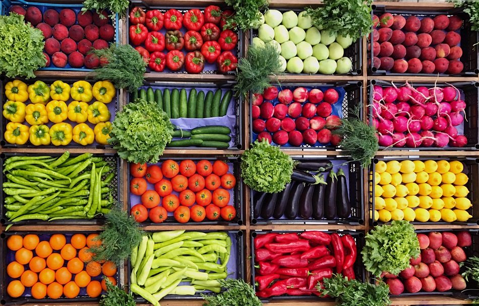

# Foodmart Business Intelligence

## Introduction
This foodmart store dataset, an adaptation of the microsoft Advwenture Works PowerBI training was sourced online. I decided to practice and hone my PowerBI skills using the fataset.

### PowerBI concepts
- Connecting and Shaping Data
- Cardinarlity and Normalization
- Filtering
- Calculated Collumns and DAX Measures
- Data Visualization
- PowerBI service

### Problem Statement
Foodmart stores, a global foodstore plans to conduct an End to End Business intelligence on their business.
- Sales 
- Revenue
- Profit
- Product performance
- Customers
- Region analysis
### Data Sourcing
The consist of 8 raw csv files containing:
- Calendar
- Customers
- Products
- Regions
- Returns
- Stores 
- 2 year Transactions data
### Data Transformation and Cleaning
The Power Query Editor within PowerBI was used to efficiently clean and transform the data, some steps includes:

- Making first rows as headers
- Creating a rolling calendar to add a date table
- Adding Index and Conditional column
- Converting tables to the correct data type
### Data Modelling
The various tables where connected in PowerBI relationship window in a star schema format, where the transactions and returns table are the fact table, while the rest are lookups. The relation was formed using primary keys and foreign keys within the different tables.

### Data Analysis and Visualizations

#### Analysis
1. Total Revenue is $1.76 million
2. Total Profit is $1.05 million
3. Store's Profit Margin is 59.67%
4. A total of 833,000 products have been sold by the store
5. Total product returned is 7,087 with a rate of 0.99%
#### Recommendations
- The store has increasing revenue over the 2 year period, the declining last month transactions and revenue is most likely due to the declining data.
- USA is the most profitable country for the store country followed by Mexico then Canada.
- Most profitable products are food and drinks, with Lake Branded food items bringing the most revenue followed by Fabulous Branded drinks, and thirdly Walrus Wine products.
  

Overall FOODMART stores has a promising and flourishing outlook, they can further optimize the business by making sure food and drink items are constantly available in their stores. They should also unlock growth in Canada by increasing the number of stores in the country, as this is the major reason for reduced revenue from the country compared to others.
-
